# maxlang MODULATORS documentation


[toc]


## **_commontoall_**

- **name**  


 - _unit:_ string
 - _descr:_ define your own name for this modulator to be able to address it later.
  you can address modulator parameters directly by sending **modparam mymodtor.freq 2.4** on the modulated parameter in the form **modparam \<modtor name>.\<modtor param>**.  
  For example, if an lfo modtor is connected to the frequency of a filter module named greatfilter:  
  **scene1.clar-chain1.greatfilter** freq **modparam mymodtor.freq 0.3**  
Here **scene1** is the scene name, **clar-chain1** is the chain name and **greatfilter** is my controlled filter module.    

- **sync** (message)

	- _unit:_ optional **phase** float (0. 1.)
	- _descr:_ reset the phase of the modulator, means resync at a beginning of a lfo, a seq, etc.
	- _usage:_ 
		**scene1.clar-chain1.greatfilter freq sync 0.**  
		**scene1.clar-chain1.greatfilter freq sync 0.5**

- **seed**

	- _unit:_ symbol
	- _descr:_ Set the seed of the random generator for each module. It allows with a same seed to always have the same random number sequence. If you don't specify a seed, the default behavior is having a always different random sequence.
	- _usage:_ see the differences between these modtor configs:  
		**choice(freq=10 list=[ 10 15 50 90 ] seed=DUF )**  
		**choice(freq=10 list=[ 10 15 50 90 ] seed=DAF )**  
		**choice(freq=10 list=[ 10 15 50 90 ])**


---
## **line**

  ramp a value

  ```
   line( min=0 max=100 time=2000 varitime=0.5 curve=0.2)
  ```

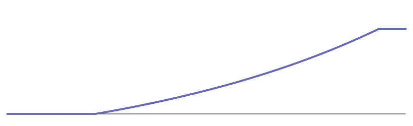


- **time**  time to reach the value
  - _unit:_ ms : float
  - _default:_ 2000.
  - _min:_ 1.
  - _max:_ none

- **varitime** amount of randomization of time (chosen at start time). varitime=1. means randomize between 0.5\*time to 2\*time. 
  - _unit:_ coeff : float
  - _default:_ 0.
  - _min:_ 0.
  - _max:_ none

- **min** output min ( optional : if omitted line starts from previous value
  - _unit:_  float
  - _default:_ last-value

- **max**  output max
  - _unit:_  float
  - _default:_ 1.

- **curve** distribution of values
  - _unit:_  float
  - _default:_ 0.
  - _min:_ -1.
  - _max:_ 1.


---
## **lfo**

  low frequency oscillator for modulation purpose.  
1:sinus
2:square
3:sawup
4:sawdown
5:tri


  ```
  lfo(freq=6 min=0 max=100 mode=1)
  lfo(freq=seq(list=[1 16 1 32] freq=1) min=40 max=70 mode=2)
  lfo(freq=6 min=0 max=100 mode= line(min=1 max=3 time=2000))
  ```
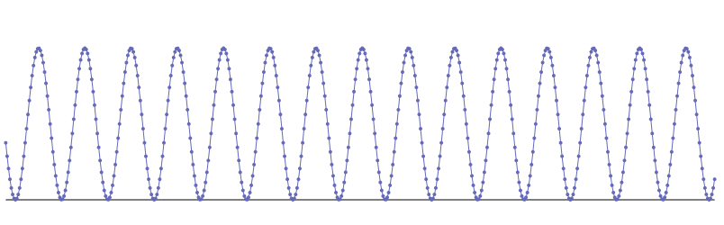
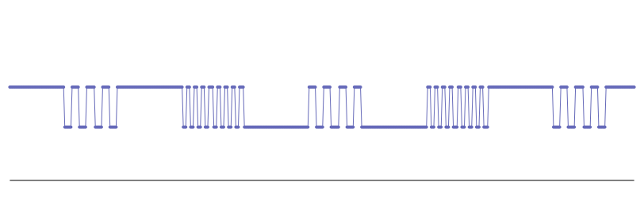
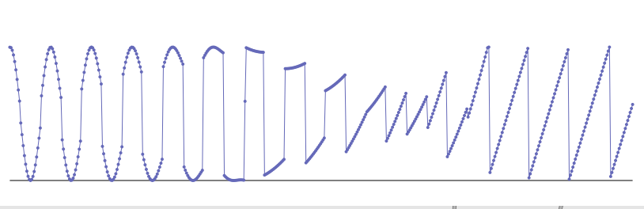

- **freq** frequency of the LFO
  - _unit:_ Hz : float
  - _default:_ 0.5
  - _min:_ 0.
  - _max:_ none

- **varifreq** amount of randomization of frequency
  - _unit:_ coeff : float
  - _default:_ 0.
  - _min:_ 0.
  - _max:_ none

- **mode** waveform interpolate between 1:sine 2:rect 3:sawup 4:sawdown 5:tri.
  - _unit:_ type : float  interpolate between shapes 
  - _default:_ 1.
  - _min:_ 1.
  - _max:_ 5.

- **pw** waveform pulsewidth ( only affects mode:2 and mode:5)
  - _unit:_ width : float
  - _default:_ 0.
  - _min:_ -1.
  - _max:_ 1.

- **min**  output min
  - _unit:_  float
  - _default:_ -1.

- **max** output max
  - _unit:_  float
  - _default:_ 1.

- **curve** distribution of values
  - _unit:_  float
  - _default:_ 0.
  - _min:_ -1.
  - _max:_ 1.


---
## **rand**

  random value generator **with no interpolation**

  ```
  rand(name=myrand min=72 max=83 freq=8 varifreq=0 walk=1 seed=DAF)
  rand( min=0 max=100 freq=8 walk=0.1)
  rand( min=0 max=127 freq=40 walk=1)
  rand( min=0 max=127 freq=40 walk=1 curve=0.9)
  ```

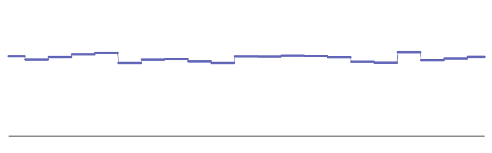
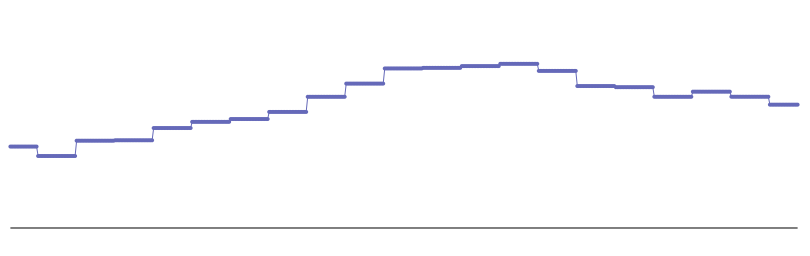
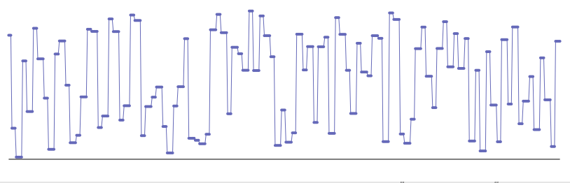
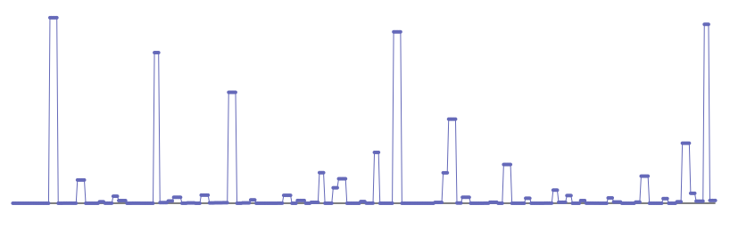

- **freq** frequency of the gen
  - _unit:_ Hz : float
  - _default:_ 0.5
  - _min:_ 0.
  - _max:_ none

- **varifreq** amount of randomization of frequency
  - _unit:_ coeff : float
  - _default:_ 0.
  - _min:_ 0.
  - _max:_ none

- **walk** how far is the random number from the previous one (random walks)
  - _unit:_ amount : float
  - _default:_ 1
  - _min:_ 0
  - _max:_ 1

- **min**  output min
  - _unit:_  float
  - _default:_ -1.

- **max** output max
  - _unit:_  float
  - _default:_ 1.

- **curve** distribution of values
  - _unit:_  float
  - _default:_ 0.
  - _min:_ -1.
  - _max:_ 1.


---
## **randi**

  random value generator **with interpolation**

  ```
  randi(name=myrand min=72 max=83 freq=8 varifreq=0 walk=1 seed=DAF)
  randi( min=0 max=100 freq=8 segcurve=0.5)
  randi( min=0 max=127 freq=40 walk=1)
  randi( min=0 max=127 freq=40 walk=1 curve=0.9)
  ```
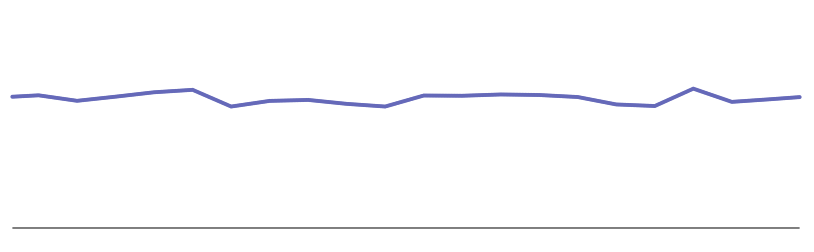
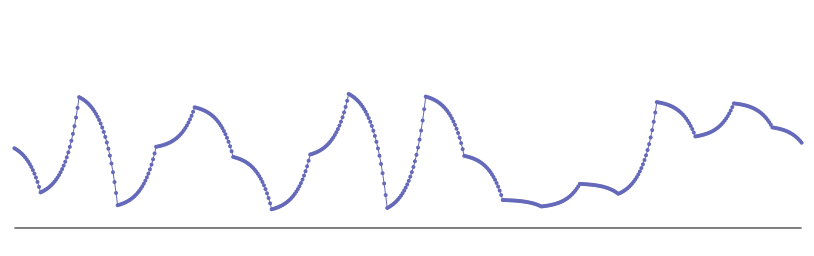
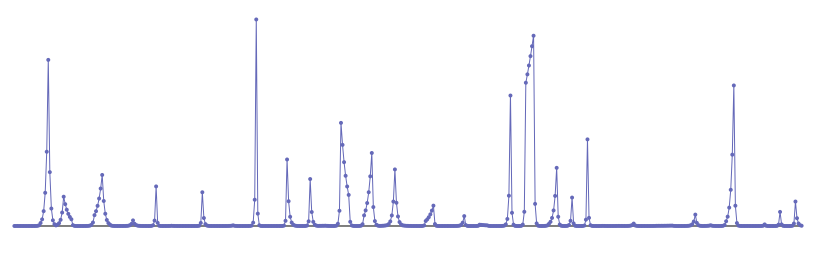
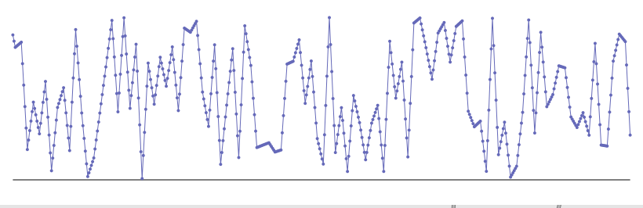

- **freq** frequency of the gen
  - _unit:_ Hz : float
  - _default:_ 0.5
  - _min:_ 0.
  - _max:_ none

- **varifreq** amount of randomization of frequency
  - _unit:_ coeff : float
  - _default:_ 0.
  - _min:_ 0.
  - _max:_ none


- **walk**  how far is the random number from the previous one (random walks)
  - _unit:_ amount : float
  - _default:_ 1
  - _min:_ 0
  - _max:_ 1

- **segcurve**  curve profile of each line segment
  - _unit:_ amount : float
  - _default:_ 0.
  - _min:_ -1.
  - _max:_ 1.

- **min** min output
  - _unit:_  float
  - _default:_ -1.

- **max**  max output
  - _unit:_  float
  - _default:_ 1.

- **curve** distribution of values
  - _unit:_  float
  - _default:_ 0.
  - _min:_ -1.
  - _max:_ 1.

---
## **choice**

  random value generator from a list of value **with no interpolation**

  ```
  choice(freq=10 list=[ 10 15 50 90 ] seed=DUF)
  choice(freq=10 list=[ 10 15 50 90 ] seed=DUF mul=0.3)
  lfo(freq=6. mode=5 min=choice(list=[36 38 40] freq=3 seed=DADA) max=choice(list=[84 91 120] freq=3 seed=CAT))

  ```

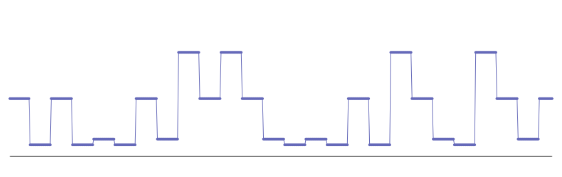
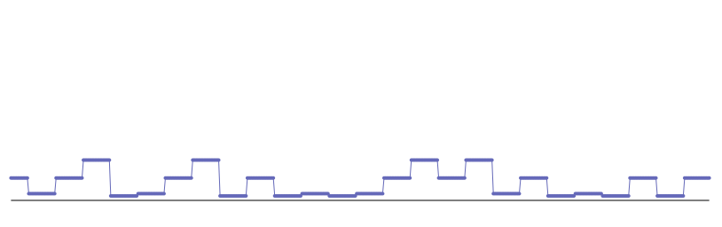
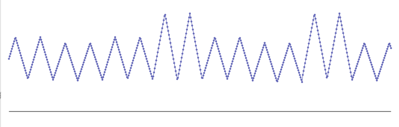


- **freq** frequency of the gen
  - _unit:_ Hz : float
  - _default:_ 0.5
  - _min:_ 0.
  - _max:_ none

- **varifreq** amount of randomization of frequency
  - _unit:_ coeff : float
  - _default:_ 0.
  - _min:_ 0.
  - _max:_ none

- **list** list of value to choose from
  - _unit:_ array : [ float float ... ]


- **mul**  multiply factor for the output value
  - _unit:_  float
  - _default:_ 1.

- **add** additive factor for the output value
  - _unit:_  float
  - _default:_ 0.


---
## **choicei**

  random value generator from a list of value **with interpolation**

  ```
  choicei(freq=10 list=[ 10 15 50 90 ] seed=DUF)
  choicei(freq=10 list=[ 10 15 50 90 ] seed=DUF segcurve=0.7)
  choicei(freq=10 list=[ 10 15 50 90 ] seed=DUF mul=0.3 add=50)
  choicei(freq=10 varifreq=2 list=[ 10 15 50 90 ] seed=DUF segcurve=-0.8 )

  ```

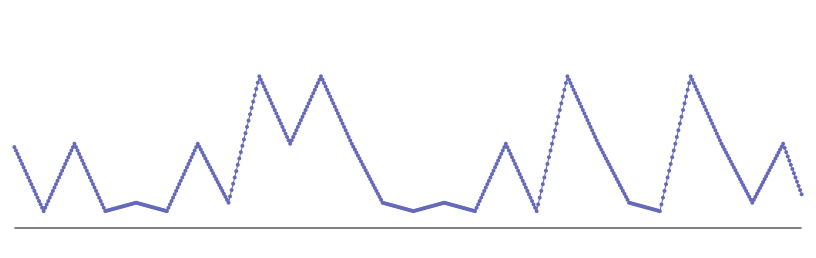
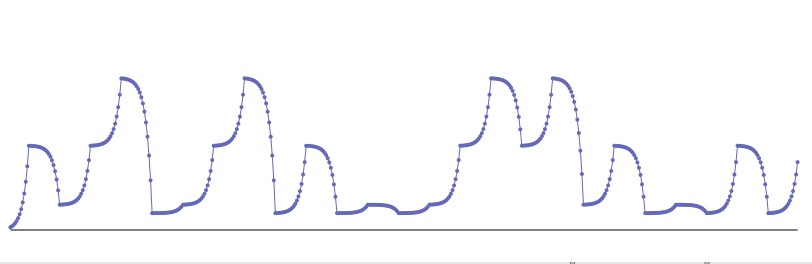
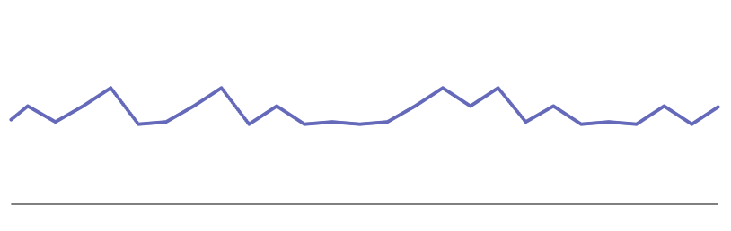
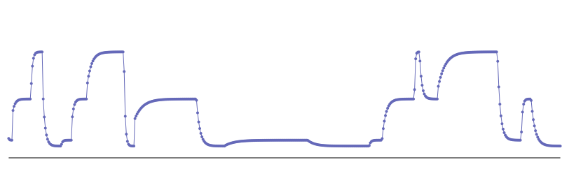


- **freq** frequency of the gen
  - _unit:_ Hz : float
  - _default:_ 0.5
  - _min:_ 0.
  - _max:_ none

- **varifreq** amount of randomization of frequency
  - _unit:_ coeff : float
  - _default:_ 0.
  - _min:_ 0.
  - _max:_ none

- **segcurve**  curve profile of each line segment
  - _unit:_ amount : float
  - _default:_ 0.
  - _min:_ -1.
  - _max:_ 1.

- **list** list of value to choose from
  - _unit:_ array : [ float float ... ]


- **mul**  multiply factor for the output value
  - _unit:_  float
  - _default:_ 1.

- **add** additive factor for the output value
  - _unit:_  float
  - _default:_ 0.


---
## **seq**

  sequence of value **with no interpolation**

  ```
  seq(freq=10 list=[ 10 15 50 90 ])
  seq(freq=10 list=[ 10 15 50 90 ] mul=0.3)
  seq(freq=10 list=[ 10 15 50 90 ] loop=0)
  seq(freq=5 list=[10 90 20 80 30 60 50 40 30 20 10] loop=0)

  ```

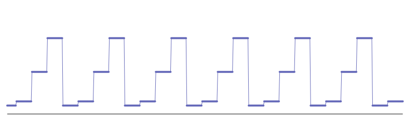
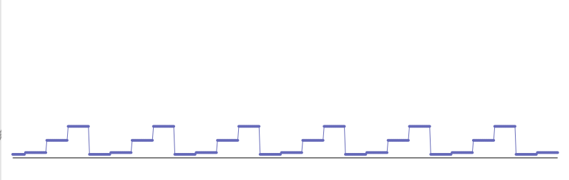
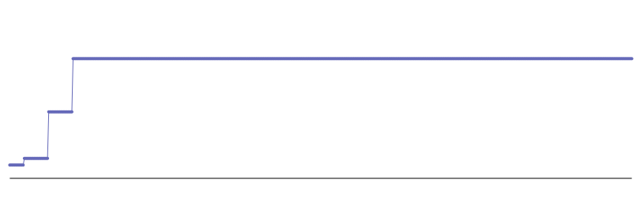
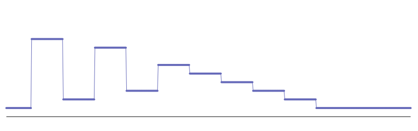


- **freq** frequency of the gen
  - _unit:_ Hz : float
  - _default:_ 0.5
  - _min:_ 0.
  - _max:_ none

- **varifreq** amount of randomization of frequency
  - _unit:_ coeff : float
  - _default:_ 0.
  - _min:_ 0.
  - _max:_ none

- **loop** loop sequence option
  - _unit:_ 0/1
  - _default:_ 1

- **play** play and stop sequence. restart sequence if play=0 and then play=1
  - _unit:_ 0/1
  - _default:_ 1

- **list** list of value to choose from
  - _unit:_ array : [ float float ... ]


- **mul**  multiply factor for the output value
  - _unit:_  float
  - _default:_ 1.

- **add** additive factor for the output value
  - _unit:_  float
  - _default:_ 0.


---
## **seqi**

  sequence of value **with interpolation**

  ```
  seqi(freq=10 list=[ 10 15 50 90 ] segcurve=0.4 )
  seqi(freq=10 list=[ 10 15 50 90 ] mul=0.3 )
  seqi(freq=5 list=[ 10 100 15 50 90 ] loop=0 )
  seqi(freq=5 list=[10 90 20 80 30 60 50 40 30 20 10] loop=0 segcurve=0.7)

  ```

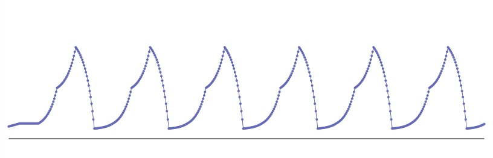
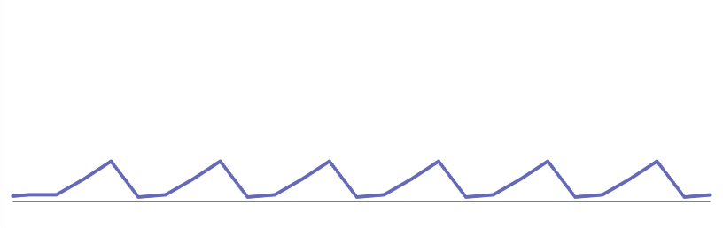
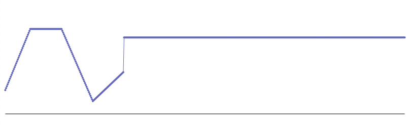
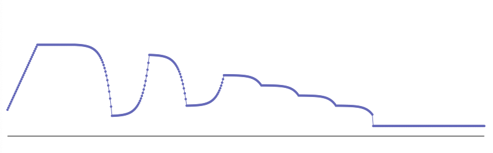


- **freq** frequency of the gen
  - _unit:_ Hz : float
  - _default:_ 0.5
  - _min:_ 0.
  - _max:_ none

- **varifreq** amount of randomization of frequency
  - _unit:_ coeff : float
  - _default:_ 0.
  - _min:_ 0.
  - _max:_ none

- **segcurve**  curve profile of each line segment
  - _unit:_ amount : float
  - _default:_ 0.
  - _min:_ -1.
  - _max:_ 1.

- **loop** loop sequence option
  - _unit:_ 0/1
  - _default:_ 1

- **play** play and stop sequence. restart sequence if play=0 and then play=1
  - _unit:_ 0/1
  - _default:_ 1

- **list** list of value to choose from
  - _unit:_ array : [ float float ... ]


- **mul**  multiply factor for the output value
  - _unit:_  float
  - _default:_ 1.

- **add** additive factor for the output value
  - _unit:_  float
  - _default:_ 0.

---
## **env**

  envelope defined as a list of value and time between values.  
  The envelope is defined with a list of value as :  
  **list=[x1 t1 x2 t2 x3]**.  
  x are values  
  t are time coeff between value.  
  the time unit is not relevant here as the env length is always scaled to the **time=** parameter.  
  what is important here is the ratio between the differents t.
  
  **caution:** length of the list should always be **odd** and **>= 3**

  ```
  env(time=1500 list=[ 0 1. 100 1. 0 ] segcurve=0.4 )
  env(time=500 list=[ 0 1. 100 1. 0 ] segcurve=0.4 )
  env(time=1500 list=[ 0 0.1 100 1. 0 ] segcurve=0.4 )
  env(time=2000 list=[ 0 1. 100 10. 50 20. 0] segcurve=-0.4 ) 

  ```

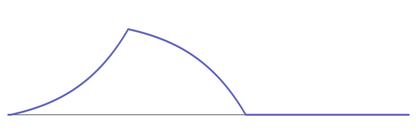
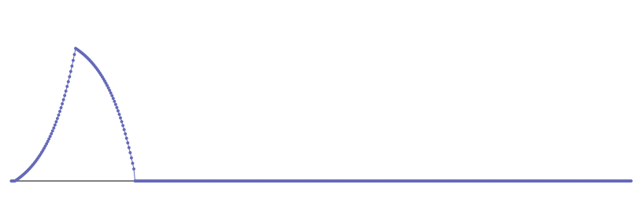
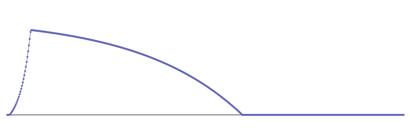
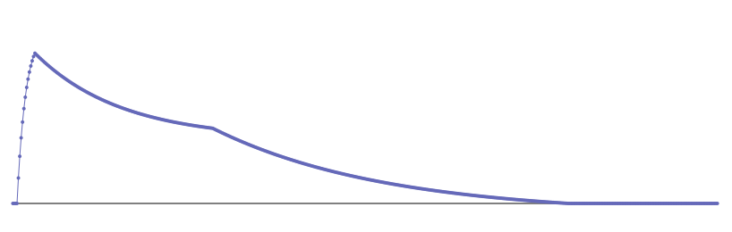


- **time**  length of the overall envelope
  - _unit:_ ms : float
  - _default:_ 2000.
  - _min:_ 1.
  - _max:_ none

- **varitime** amount of randomization of length (chosen at start time). varitime=1. means randomize between 0.5\*time to 2\*time. 
  - _unit:_ coeff : float
  - _default:_ 0.
  - _min:_ 0.
  - _max:_ none
 
- **segcurve**  curve profile of each line segment
  - _unit:_ amount : float
  - _default:_ 0.
  - _min:_ -1.
  - _max:_ 1.

- **loop** loop enveloppe option. default is no loop.
  - _unit:_ 0/1
  - _default:_ 0

- **play** play and stop enveloppe. restart sequence if play=0 and then play=1
  - _unit:_ 0/1
  - _default:_ 1

- **list** list of value to choose from
  - _unit:_ array : [ float float ... ]


- **mul**  multiply factor for the output value
  - _unit:_  float
  - _default:_ 1.

- **add** additive factor for the output value
  - _unit:_  float
  - _default:_ 0.


---
## **xfade**

  crossfade between 2 values or modulators.  
  you can mix 2 modtors.  
  you can pass smoothly from a modtor **a=** to another **b=**.  
    
  **a=** and **b=** are the two inputs of the module.
  
  **fade=** (0. 1.) fades smoothly from a (0.) to b (1.). 
  should be modulated.
  
  **fadecurve=** modifies the shape of the fade.
  
 it guarantee that **(amplitude of a) + (amplitude of b) = 1.**

  ```
  xfade(a= lfo(freq=15.) b=lfo(freq=5.) add=60 mul=12 fade=randi(freq=0.05 min=0.1 max=0.9))
  xfade(a=line(min=0 max=100 time=2000) b= lfo(freq=15. min=0 max=100) fade=line(min=0 max=1 time=2000))

  ```

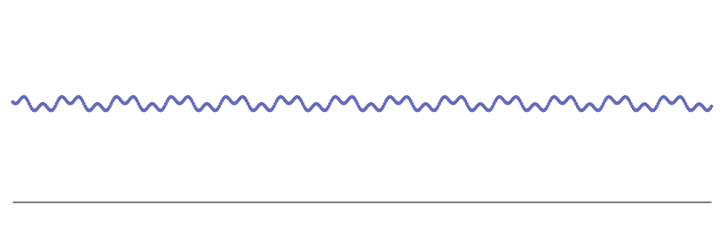
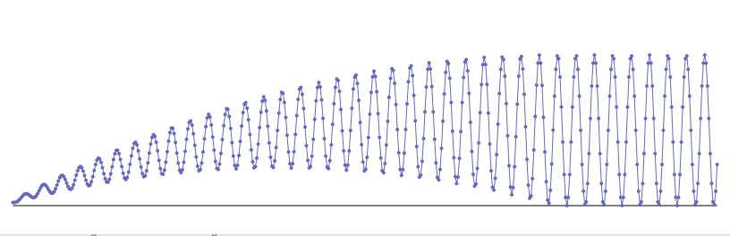

- **a**  input a 
  - _unit:_ val : float
  - _default:_ last value for parameter

- **b**  input b
  - _unit:_ val : float
  - _default:_ 1.

- **fadecurve** curve profile of fader
  - _unit:_ amount : float
  - _default:_ 0.
  - _min:_ -1.
  - _max:_ 1.

- **mul**  multiply factor for the output value
  - _unit:_  float
  - _default:_ 1.

- **add** additive factor for the output value
  - _unit:_  float
  - _default:_ 0.


---
## **input**

  external value from Max environment. use the **maxlang.input <myinputname>** to set the value from max.  
  Usefull for any realtime input like **MIDI**, sensors, ...
  
  **in=** should refer to the realtime input you want to get.

  ```
  input(in=pedal1 min=64 max=110)
  lfo(freq=9 min=0 max=input(in=pedal1 min=0. max=100 curve=0.3))
  ```
 

 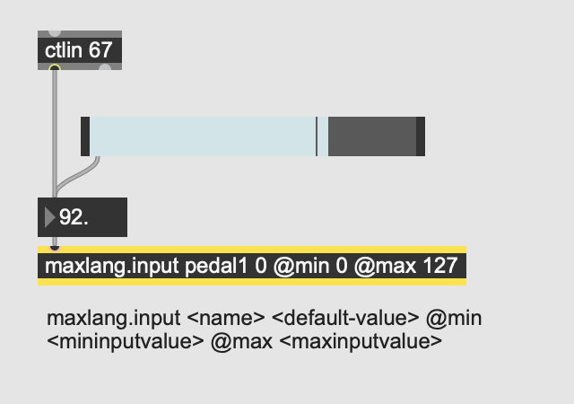
 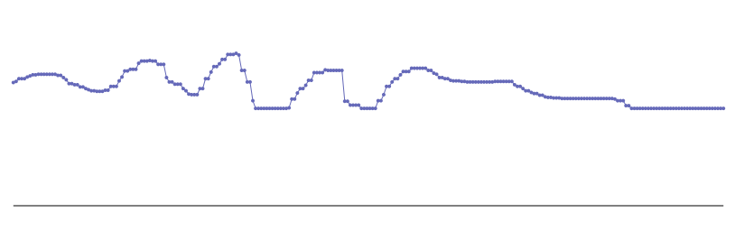
 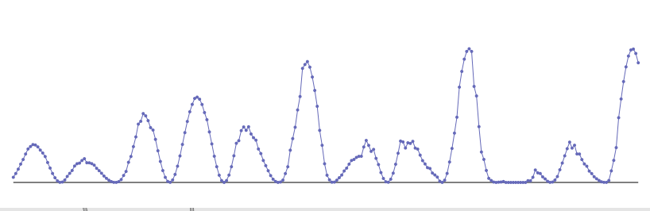

- **input** name of the input ( there must be in the patch an object **maxlang.input <myinputname>**
  - _unit:_ symbol 


- **min** output min
  - _unit:_  float
  - _default:_ -1.

- **max**  output max
  - _unit:_  float
  - _default:_ 1.

- **curve** distribution of values
  - _unit:_  float
  - _default:_ 0.
  - _min:_ -1.
  - _max:_ 1.

	))