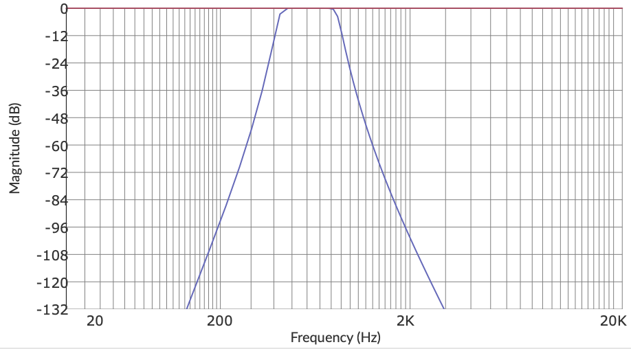
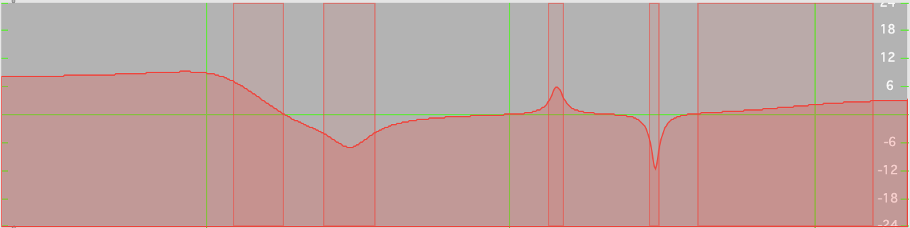
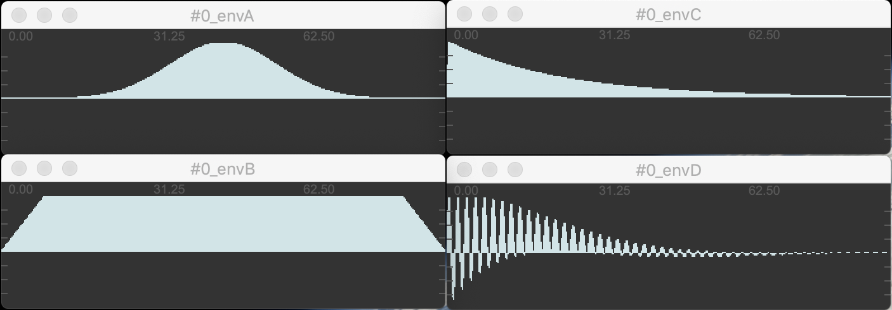

# maxlang MODULES documentation

[toc]

## **_commontoall_**

- **name**  

```
module name=myfavoritemodule ....
```
  - _unit:_ string
  - _descr:_ define yout own name for this module to be able to address it later.
  you can send parameters directly with **send scenename.chainname.myfavoritemodule**  
  You can then send specific module parameter values as CUE messages:  
  **scene1.clar-chain1.greatfilter** freq 234.  
  **scene1.clar-chain1.greatfilter** freq line(min=100 max=200 time=10000)
  
  Here **scene1** is the scene name, **clar-chain1** is the chain name and **greatfilter** is my controlled filter module.


---
## **in**

  audio in from specific adc.

  ```
  in adc=[1 2] # input Clar
  ```

  - **adc=**  define adc channel to get audio from
    - _unit:_ array : [integer integer ...]
    - _default:_ [1 2]
  - **gain=** db gain
	  - _unit:_ dB : float
	  - _default:_ 0.
	  - _min:_ none
	  - _max:_ none

You can specify up to 4 adc channel number.  
Valid messages are:  
**in** adc=[1]  
**in** adc=[5 6 7 8]  
**in** adc=[3 4] gain=12.


---
## **out**

  audio out to specific dac.
  vca features to control volumes of multiples chains.

  ```
  out vca=1 dac=[1 2 3 4]
  ```

  - **dac=**  define dac channel to send audio to
    - _unit:_ array : [integer  integer ...]
    - _default:_ [1 2]

  - **vca=**  vca channel bind to this output
    - _unit:_ number : integer
    - _default:_ 1
    - _min:_ 1
    - _max:_ 8

  - **gain=** db gain
	  - _unit:_ dB : float
	  - _default:_ 0.
	  - _min:_ none
	  - _max:_ none

---
## **sendbus**

  send audio on a named bus ( like a send~ ). The audio can be fetched in another module with **receivebus** with the same name.  It also passes the module input to its output unchanged.  
  Bus has 4 channels.
  

  ```
  sendbus bus=myintermediatesignal
  ```

  - **bus=**  name of the bus
    - _unit:_ symbol 
    - _default:_ none
- **gain=** gain in db applied to the sent signal
	  - _unit:_ dB : float
	  - _default:_ 0.
	  - _min:_ none
	  - _max:_ none

---
## **receivebus**

  receives audio from a named bus ( like a receive~ ) from another module.

  ```
  receivebus bus=myintermediatesignal
  ```

 - **bus=**  name of the bus
    - _unit:_ symbol 
    - _default:_ none
- **gain=** gain in db applied to the received signal
	  - _unit:_ dB : float
	  - _default:_ 0.
	  - _min:_ none
	  - _max:_ none
---
## **imager**

variable delay of audio signal. time can be modulated (makes kind of simple granular mashup).
**feedback** (0. 100.) reinject outputs into input.

```
delay time=rand(freq=5 varifreq=2 min=0 max=5000 curve=1)

```

- **time=** delay time in ms
  - _unit:_ time ms : float
  - _default:_ 0.
  - _min:_ 0.
  - _max:_ 60000.

- **feedback=** cross feedback in % of the delay line
  - _unit:_ % : float
  - _default:_ 0.
  - _min:_ 0.
  - _max:_ 100.

- **drywet=** crossfade in % between dry and wet signal
  - _unit:_ % : float
  - _default:_ 100.
  - _min:_ 0.
  - _max:_ 100.

- **gain=** gain in dB
  - _unit:_ dB : float
  - _default:_ 0.
  - _min:_ none
  - _max:_ none


---
## **delay**

variable delay of audio signal. time can be modulated (makes kind of simple granular mashup).
**feedback** (0. 100.) reinject outputs into input.

```
delay time=rand(freq=5 varifreq=2 min=0 max=5000 curve=1)

```

- **time=** delay time in ms
  - _unit:_ time ms : float
  - _default:_ 0.
  - _min:_ 0.
  - _max:_ 60000.

- **feedback=** cross feedback in % of the delay line
  - _unit:_ % : float
  - _default:_ 0.
  - _min:_ 0.
  - _max:_ 100.

- **drywet=** crossfade in % between dry and wet signal
  - _unit:_ % : float
  - _default:_ 100.
  - _min:_ 0.
  - _max:_ 100.

- **gain=** gain in dB
  - _unit:_ dB : float
  - _default:_ 0.
  - _min:_ none
  - _max:_ none

---
## **multidelay**

  bunch of 12 delays with random distribution between _time_ and _time_ + _timeframe_. _timecurve_ sets the time distribution in the time frame. _ampdecay_ set the amp distribution of the delay taps.

  ```
  multidelay drywet=50 feedback=50 time=100 timeframe=1000 ampdecay=0 seed=CBA


  ```
  - **ingain=** gain in dB of the input signal feeding the delay.
    - _unit:_ dB : float
    - _default:_ 0.
    - _min:_ none
    - _max:_ none

  - **time=** first delay time in ms
    - _unit:_ time ms : float
    - _default:_ 200.
    - _min:_ 0.
    - _max:_ 60000.

  - **timeframe=** duration between first and last delay tap
    - _unit:_ time ms : float
    - _default:_ 1000.
    - _min:_ 0.
    - _max:_ 60000.

  - **timecurve=** time distribution of the random delay taps. 0 means equally distributed delays. 1.5 means delays are generally closer to start time than to end time.
    - _unit:_ curve : float
    - _default:_ 0.
    - _min:_ -1.
    - _max:_ 1.

  - **ampdecay=** amp distribution (if you want the delay amp to decay)
    - _unit:_  float
    - _default:_ 0.
    - _min:_ 0.
    - _max:_ 100.


  - **feedback=** cross feedback in % of the delay line
    - _unit:_ % : float
    - _default:_ 0.
    - _min:_ 0.
    - _max:_ 100.

  - **seed=** 3 letters to seed the random generator. ex: ABC, ADA, ZOU. A the delay random distribution will always be the same when you specify a specific seed. The default is no seed, means it will be always different.
    - _unit:_ 3 LETTERS (ABA,...)
    - _default:_ none


  - **drywet=** crossfade in % between dry and wet signal
    - _unit:_ % : float
    - _default:_ 100.
    - _min:_ 0.
    - _max:_ 100.

  - **gain=** gain in dB
    - _unit:_ dB : float
    - _default:_ 0.
    - _min:_ none
    - _max:_ none


---
## **filter**

  Multimode butterworth filter. Can be Lowpass, Highpass, Bandpass, Bandnotch. Filter can be very selective as it has a very sharp slope (around -36db/oct) and has a flat response in the selected frequency range (no resonance).

  ```
  filter freq=660 mode=2 width=12 # bandpass (mode 2)

  ```




  - **freq=** central frequency of the filter
    - _unit:_ Hz : float
    - _default:_ 200.
    - _min:_ 20.
    - _max:_ 20000.

  - **mode=** mode of filter 0:lowpass 1:highpass 2:bandpass 3:bandstop
    - _unit:_ type : int
    - _default:_ 1 (highpass)
    - _min:_ 0
    - _max:_ 3

  - **width=** bandwidth for bandpass and bandstop mode in semitones
    - _unit:_ semitones : float
    - _default:_ 12.
    - _min:_ 0.1
    - _max:_ none

- **gain=** gain in dB
  - _unit:_ dB : float
  - _default:_ 0.
  - _min:_ none
  - _max:_ none


---
## **eq**

  Low-Shelf, High-Shelf and 3 Peak/Notch Equalizer module.

  ```
  eq lf=150 lg=8. p1f=300. p1g=-6. p2f=1430. p2g=6 p2q=8. p3f=3000 p3g=-12. p3q=12. hf=8000 hg=3. hq=0.7

  ```
  
  


  - **lf=** Low-Shelf frequency
    - _unit:_ Hz : float
    - _default:_ 120.
  - **hf=** High-Shelf frequency
    - _unit:_ Hz : float
    - _default:_ 2900.
  - **p1f=** Peak 1 frequency
    - _unit:_ Hz : float
    - _default:_ 350.
  - **p2f=** Peak 2 frequency
    - _unit:_ Hz : float
    - _default:_ 800.
  - **p3f=** Peak 3 frequency
    - _unit:_ Hz : float
    - _default:_ 1500.

- **lg= hg= p1g= p2g= p3g=** Gain for each bands
    - _unit:_ dB : float
    - _default:_ 0.
- **lq= hq= p1q= p2q= p3q=** Q factor for each bands
    - _unit:_ float
    - _default:_ 2.5
    - _min:_ 0.01


- **gain=** gain in dB
  - _unit:_ dB : float
  - _default:_ 0.
  - _min:_ none
  - _max:_ none


---
## **disto**

  Cubic nonlinearity distortion. ( Faust version )  
  **warning** : can be loud and tricky in live situation.


  ```
  disto drive=0.3 offset=0.01 drywet=50

  ```

  - **drive=** drive amount
    - _unit:_ amount : float
    - _default:_ 0.
    - _min:_ 0.
    - _max:_ 1.

  - **offset=** constant added before nonlinearity to give even harmonics.  
    - _unit:_ value : float
    - _default:_ 0.
    - _min:_ -4.
    - _max:_ 4.

  - **drywet=** crossfade between dry and wet signal
    - _unit:_ % : float
    - _default:_ 100.
    - _min:_ 0.
    - _max:_ 100.

- **gain=** gain in dB
  - _unit:_ dB : float
  - _default:_ 0.
  - _min:_ none
  - _max:_ none

---
## **freqshift**

  frequency shifter of audio signal.

  ```
  freqshift shift=randi(freq=0.1 min=-100 max=100 curve=0)

  ```

  - **shift=** shift amount in Hz
    - _unit:_ Hz : float
    - _default:_ 0.
    - _min:_ none
    - _max:_ none

  - **drywet=** crossfade in % between dry and wet signal
    - _unit:_ % : float
    - _default:_ 100.
    - _min:_ 0.
    - _max:_ 100.

- **gain=** gain in dB
  - _unit:_ dB : float
  - _default:_ 0.
  - _min:_ none
  - _max:_ none

---
## **gizmo**

  transpose audio signal with gizmo~ (fft scaling method).

  ```
  gizmo ratio= 0.2

  ```

  - **ratio=** frequency multiplier
    - _unit:_ ratio : float
    - _default:_ 1.
    - _min:_ 0.001
    - _max:_ 64.

- **gain=** gain in dB
  - _unit:_ dB : float
  - _default:_ 0.
  - _min:_ none
  - _max:_ none

---
## **pitchshift**

  pitch shifter of audio signal. uses pitchshift~.  
  special **chord=** feature to make a 4 layers of transposition. **transp=** can be modulated and is added to each layer transposition.
  

  ```
  pitchshift transp=-1200.  
  pitchshift chord=[0 200 700 850] transp=0.
  ```

 - **transp=** pitchshift amount in cents
    - _unit:_ cents : float
    - _default:_ 0.
    - _min:_ none
    - _max:_ none
 - **chord=** array of transposition ex: [-100 100]. only at module creation time, can't be modulated nor set by message.
    - _unit:_ array [cents : float ]
    - _default:_ 0.
    - _min:_ none
    - _max:_ none
- **drywet=** crossfade in % between dry and wet signal
    - _unit:_ % : float
    - _default:_ 100.
    - _min:_ 0.
    - _max:_ 100.
- **gain=** gain in dB
	  - _unit:_ dB : float
	  - _default:_ 0.
	  - _min:_ none
	  - _max:_ none

---
## **spectralcompand**

  spectral compressor to balance between sinusoidal part and noisy part of the input signal.  
 **sinusnoise=** parameter (0. 100.) balance the signal between noise (0) and sinus(100). 50 keeps the signal unchanged.
 **tilt=** parameter (-6. 6.) tilts the threshold line to change the timbre of the output.

  ```
  spectralcompand sinusnoise=0
  spectralcompand sinusnoise=100
  spectralcompand sinusnoise=lfo(min=25 max=75 freq=3)  
  spectralcompand sinusnoise=0 threshold=lfo(min=-60. max=-20. freq=0.2) 

  ```

 - **sinusnoise=** balance between sinus and noise (0. 100.)
    - _unit:_ % : float
    - _default:_ 100.
    - _min:_ 0.
    - _max:_ 100.
 - **threshold=** spectral threshold in dB for sinus/noise discrimination
    - _unit:_ dB : float
    - _default:_ -45.
    - _min:_ -96.
    - _max:_ 0.
- **tilt=** slope of the spectral threshold so its becomes dependant of spectral frequency.
    - _unit:_ slope : float
    - _default:_ -2.
    - _min:_ -6.
    - _max:_ 6.
- **drywet=** crossfade in % between dry and wet signal
    - _unit:_ % : float
    - _default:_ 100.
    - _min:_ 0.
    - _max:_ 100.
- **gain=** gain in dB
	  - _unit:_ dB : float
	  - _default:_ 0.
	  - _min:_ none
	  - _max:_ none

---
## **svptrans**

supervp transposer. pretty amount of sound tweaking between sinus and noise parts.
warning : adds latency (1024 pts ~= 20 ms).  
Things to experiment:  
**envscale** between 0. and 2. make timbre brighter or muffled.   
**sinus** and **noise** set the gain (0. 1.) of the sinusoidal part and the noise part of the signal.

```
svptrans transp=-50. envscale=0.7  sinus=1. noise=0.5 error=0.2 gain=0
```

- **transp=** transposition factor in cents  
  - _unit:_ cents : float
  - _default:_ 0.
  - _min:_ none
  - _max:_ none

- **transpadd=** second transposition factor to add to _transp_ (allows modulating for example)
  - _unit:_ cents : float
  - _default:_ 0.
  - _min:_ none
  - _max:_ none

- **envscale=** frequency scaling of the spectral envelope. sets _envscale.timbre_ and _envscale.mean_
    0.5 : brighter sound
    1.5 : muffled sound
  - _unit:_ coeff : float
  - _default:_ 1.
  - _min:_ 0.
  - _max:_ 2.


- **envscale.timbre=** timbre part of envscale
  - _unit:_ coeff : float
  - _default:_ 1.
  - _min:_ 0.
  - _max:_ 2.

- **envscale.mean=** mean part of envscale
  - _unit:_ coeff : float
  - _default:_ 1.
  - _min:_ 0.
  - _max:_ 2.

- **sinus=**  sinusoidal gain for resynthesis. Use it ratio with _noise_
  - _unit:_ amp lin (pow2) : float
  - _default:_ 1.
  - _min:_ 0.
  - _max:_ 2.

- **noise=** noise gain for resynthesis. Use it ratio with _sinus_
  - _unit:_ amp lin (pow2) : float
  - _default:_ 1.
  - _min:_ 0.
  - _max:_ 2.

- **error=** threshold to descriminate between _sinus_ and _noise_
  - _unit:_ thresh lin (pow3) : float
  - _default:_ 0.5
  - _min:_ 0.
  - _max:_ 1.

- **tr=** transient gain for resynthesis
  - _unit:_ amp lin (pow2) : float
  - _default:_ 1.
  - _min:_ 0.
  - _max:_ 2.

- **tr.decay=** decay time for detected transients
  - _unit:_ time ms : float
  - _default:_ 0.
  - _min:_ 0.
  - _max:_ 400.
- **drywet=** crossfade in % between dry and wet signal
    - _unit:_ % : float
    - _default:_ 100.
    - _min:_ 0.
    - _max:_ 100.
- **gain=** gain in dB
  - _unit:_ dB : float
  - _default:_ 0.
  - _min:_ none
  - _max:_ none
  
**_following are more advanced mode for experimental behaviours:_**

- **envpres=** on: more subtle
    off: make some time noise sound like glouglou, harsher  
  - _unit:_ 0/1
  - _default:_ 0

- **stereopres=** on: more subtle
    off: make some time noise sound like glouglou, harsher
  - _unit:_ 0/1
  - _default:_ 0

- **envmode=** on: lpc (more subtle)
    off: trueenv  
  - _unit:_ 0/1
  - _default:_ 0

- **lcporder=** number of poles (filter peaks) in the spectral envelope
  - _unit:_ number : int
  - _default:_ 6
  - _min:_ 1
  - _max:_ 48

- **maxfreq=** smooth the spectral envelope
  - _unit:_ Hz : float
  - _default:_ 600
  - _min:_ 0.
  - _max:_ none

- **shapeinv=**  waveform shape invariant
    on : more subtle
    off : make some time noise sound like glouglou, harsher
  - _unit:_ 0/1
  - _default:_ 0


- **sinmode=**  sinusoidal resynthesis method
    1 : additive (smoother)
    0 : vocoder
  - _unit:_ 0/1
  - _default:_ 0

---
## **svpring**

supervp ring buffer transposer real time time stretcher.  
It has the same parameters as **svptrans** so please refer to the **svptrans** documentation.

It adds several parameter to modulate the delay of the signal allowing to stretch-down incoming signal.  
It has 2 modes set with **scrubmode=** (0/1):

- 0 : stretch mode : in this mode, **stretch=** and **delaygo=** parameters are active. **stretch=** sets the speed of the playhead (0 4.) and **delaygo=** allows you to jump to a specific playhead position (eg : delay )
	
- 1 : scrub mode : in this mode, only **scrub=** parameter is active and sets the playhead position directly (in ms). very interesting to modulate with continous modulators like **lfo** **randi** or **line**


```
svpring  drywet=80 scrubmode=0 delaygo=0. stretch=0.7
svpring  drywet=80 scrubmode=0 delaygo=10000. stretch=1.6
svpring  drywet=80 scrubmode=1 scrub=line(min=0 max=10000 time=20000)
svpring  drywet=80 scrubmode=1 scrub=randi(min=0 max=5000 freq=0.15)

```

- **scrubmode=** mode of the playhead control  
  - _unit:_ int : [0/1]
  - _default:_ 0 (stretch mode)

- **stretch=** speed coefficient of the play head when **scrubmode=0**  
  - _unit:_ float : [0./4.]
  - _default:_ 1. (normal speed)
  - _min:_ 0.
  - _max:_ 4.
- **delaygo=** set the position of play head (eg delay) when **scrubmode=0** . !!Cannot be modulated !!
  - _unit:_ float : ms
  - _default:_ 0.
  - _min:_ 0.
  - _max:_ 60000.
- **scrub=** set the position of play head (eg delay) when **scrubmode=1**  
  - _unit:_ float : ms
  - _default:_ 0.
  - _min:_ 0.
  - _max:_ 60000.
- **feedback=** feedback in % of the stretcher line (experimental)
  - _unit:_ % : float
  - _default:_ 0.
  - _min:_ 0.
  - _max:_ 100.

---
## **reverb**

FDN reverb

```
reverb size=30 decay=40 damping=30 drywet=20

```

- **size=** size of the room
  - _unit:_ midiunit : float
  - _default:_ 64.
  - _min:_ 0.
  - _max:_ 127.

- **decay=** decay of the room
  - _unit:_ midiunit : float
  - _default:_ 64.
  - _min:_ 0.
  - _max:_ 127.

- **damping=**  damping of the room
  - _unit:_ midiunit : float
  - _default:_ 64.
  - _min:_ 0.
  - _max:_ 127.

- **diffusion=** diffusion of the room
  - _unit:_ midiunit : float
  - _default:_ 64.
  - _min:_ 0.
  - _max:_ 127.

- **width=** stereo width of the reverb
  - _unit:_ midiunit : float
  - _default:_ 64.
  - _min:_ 0.
  - _max:_ 127.

- **drywet=** crossfade between dry and wet signal
  - _unit:_ % : float
  - _default:_ 50.
  - _min:_ 0.
  - _max:_ 100.

- **gain=** gain in dB
  - _unit:_ dB : float
  - _default:_ 0.
  - _min:_ none
  - _max:_ none


---
## **granul**

live granulation of audio signal.  
**density=** sets the overlapping coeff of the grains. Default 8. is ~2 overlapping grains
**detune-jit=** in semitones randomize the transposition of each grains.  
**length=** sets the length of each grains. longer make mashup effect. lesser makes timbre change. 80ms keeps the timbre content of the original sound.

```
granul density=8 length=20 delay=700 delay-mod-depth=500
```



- **length=** length of each grains in milliseconds.
  - _unit:_ milliseconds : float
  - _default:_ 20.
  - _min:_ -10000.
  - _max:_ 10000.

- **env-type=** type of envelope 1: gauss 2: trapez 3: expodecay 4: modulated
  - _unit:_ number integer
  - _default:_ 1
  - _min:_ 1
  - _max:_ 4

- **density** density of overlapping grains. below 8. value for rarefaction, upper 8 for densification.
  - _unit:_ factor : float
  - _default:_ 8.
  - _min:_ 0.
  - _max:_ 16.`

- **density-jit=** density randomization amount.
  - _unit:_ milliseconds : float
  - _default:_ O.
  - _min:_ 0.
  - _max:_ 4.

- **delay=** delay time in ms of grain start. can act as a normal delay.
  - _unit:_ milliseconds : float
  - _default:_ 0.
  - _min:_ 0.
  - _max:_ 30000.


- **delay-mod-depth=** delay modulation amount.
  - _unit:_ milliseconds : float
  - _default:_ 0.
  - _min:_ 0.
  - _max:_ 30000.


- **delay-mod-freq=** frequency of the randomization of the delay time.
  - _unit:_ milliseconds : float
  - _default:_ 1.
  - _min:_ 0.
  - _max:_ 200.


- **freeze=** freeze the live sound recording feeding the granulator.
  - _unit:_ 0/1
  - _default:_ 0


- **detune=** transposition of the grain in semitones
  - _unit:_ semitones : float
  - _default:_ 0.
  - _min:_ -48.
  - _max:_ 48.


- **detune-jit=** amount of randomization of transposition in semitones
  - _unit:_ semitones : float
  - _default:_ 0.
  - _min:_ 0.
  - _max:_ 48.


- **amp-jit=** amount of randomization of the amplitude of the grains in dB
  - _unit:_ dB : float
  - _default:_ 0.
  - _min:_ 0.
  - _max:_ 48.


- **amp-pow=** distribution of the values for the amplitude randomization
  - _unit:_ milliseconds : float
  - _default:_ 20.
  - _min:_ 0.
  - _max:_ 10000.


- **spat-jit=** amount of randomization of the stereo/quadri placement of the grain
  - _unit:_ milliseconds : float
  - _default:_ 0.
  - _min:_ 0.
  - _max:_ 1.


- **rev-snd=** chance in % of sound reverse playing
  - _unit:_ % : float
  - _default:_ 0.
  - _min:_ 0.
  - _max:_ 100.


- **rev-env=** chance in % of env reverse playing
  - _unit:_ % : float
  - _default:_ 0.
  - _min:_ 0.
  - _max:_ 100.


- **drywet=** crossfade in % between dry and wet signal
  - _unit:_ % : float
  - _default:_ 100.
  - _min:_ 0.
  - _max:_ 100.

- **gain=** gain in dB
  - _unit:_ dB : float
  - _default:_ 0.
  - _min:_ none
  - _max:_ none


---
## **additive**

additive analysis synthesis of audio signal

```
# 2oct transpose with 2 partials of the original signal
additive npeak=2 freqtransp=-24 attack=5 decay=5 freqsmoo=5 hrm=0. randdev=20 
# slowly decaying partial with no transpose and with richer partials (hrm=0.3)
additive npeak=4 attack=5 decay=1000 freqsmoo=5 hrm=0.3
# frequency smoothing (chewing gum effect)
additive npeak=4 attack=5 decay=200 freqsmoo=400

```

- **freqtransp=** transpose all partials by a certain amount of semitones.
  - _unit:_ semitones : float
  - _default:_ 0.
  - _min:_ none
  - _max:_ none

- **freqshift=** shift all partials by a certain amount of Hz.
  - _unit:_ Hz : float
  - _default:_ 0.
  - _min:_ none
  - _max:_ none

- **randdev=** random shift choosed at each partial creation
  - _unit:_ Hz : float
  - _default:_ 0.
  - _min:_ 0.
  - _max:_ 100.

- **attack=** attack of amplitude enveloppe of each partials
  - _unit:_ time ms : float
  - _default:_ 5.
  - _min:_ 0.
  - _max:_ none

- **decay=** decay of amplitude enveloppe of each partials
  - _unit:_ time ms : float
  - _default:_ 5.
  - _min:_ 0.
  - _max:_ none

- **hrm=** crossfade between sinus (0.) <-> bl-square (1.) <-> noise (2.)
  - _unit:_ coeff : float
  - _default:_ 0.
  - _min:_ 0.
  - _max:_ 2.

- **freqsmoo=** smooth frequency change in a specific partial. Use it in conjonction with _filterdev_ parameter.
  - _unit:_ time ms : float
  - _default:_ 5.
  - _min:_ 0.
  - _max:_ none

- **npeak=** Numbers of sinusoidal components selected for synthesis
  - _unit:_ number : int
  - _default:_ 4
  - _min:_ 0
  - _max:_ 8

- **trigtime=** time between succesive analysis frame  
  - _unit:_ time ms : float
  - _default:_ 5
  - _min:_ 0
  - _max:_ none

- **freqmin=** Minimum frequency of selected partials
  - _unit:_ Hz : float
  - _default:_ 50
  - _min:_ 1
  - _max:_ 20000

- **freqmax=** Maximum frequency of selected partials
  - _unit:_ Hz : float
  - _default:_ 10000
  - _min:_ 1
  - _max:_ 20000

- **filteramp=** Minimum amplitude of selected partials
  - _unit:_ amp dB : float
  - _default:_ -90.
  - _min:_ -90.
  - _max:_ 0.


- **filtertilt=** spectrum slope of the threshold for amp filtering.
  - _unit:_ slope : float
  - _default:_ 0.
  - _min:_ -1.
  - _max:_ 1.

- **filterdev=** maximum amount of frequency deviation (in semitones) for the partial tracking.
  - _unit:_ semitones : float
  - _default:_ 1.
  - _min:_ 0.
  - _max:_ 48.


- **drywet=** crossfade between dry and wet signal
  - _unit:_ % : float
  - _default:_ 100.
  - _min:_ 0.
  - _max:_ 100.

- **stereo=** amount of (random) stereo distribution of partials
  - _unit:_ coeff : float
  - _default:_ 1.
  - _min:_ 0.
  - _max:_ 1.

- **gain=** db gain
  - _unit:_ dB : float
  - _default:_ 0.
  - _min:_ none
  - _max:_ none

---
## **sfplayer**

  sfplayer max 4 channels.

  ```
  sfplayer open=48_P_P_A_TRAME_4A-2.wav loop=0 speed=1
  ```

- **gain=**  gain for the player
  - _unit:_ dB : float
  - _default:_ 0.
  - _min:_ none
  - _max:_ none

- **speed=** speed of the player
  - _unit:_ coeff : float
  - _default:_ 1.
  - _min:_ none
  - _max:_ none


- **open=**  open a specific soundfile
  - _unit:_ symbol


- **play=** play the sound file from the beginning
  - _unit:_ 0/1

- **stop=**  stops the sound file
  - _unit:_ anything

- **loop=**  loop soundfile
  - _unit:_ 0/1


---
